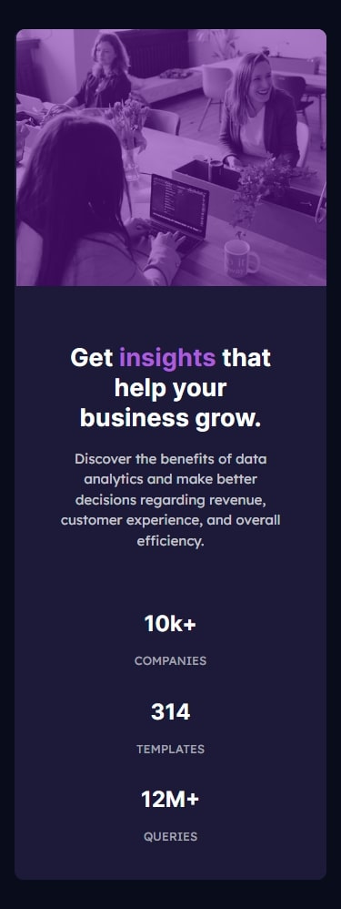

# Frontend Mentor - Stats preview card component solution

This is a solution to the [Stats preview card component challenge on Frontend Mentor](https://www.frontendmentor.io/challenges/stats-preview-card-component-8JqbgoU62). Frontend Mentor challenges help you improve your coding skills by building realistic projects. 

## Table of contents

- [Overview](#overview)
  - [The challenge](#the-challenge)
  - [Screenshot](#screenshot)
  - [Links](#links)
- [My process](#my-process)
  - [Built with](#built-with)
  - [Other tools used](#other-tools-used)
  - [What I learned](#what-i-learned)
  - [Useful resources](#useful-resources)


## Overview

### The challenge

Users should be able to:

- View the optimal layout depending on their device's screen size

### Screenshot





### Links

- Solution URL: [https://github.com/andr-ch/stats-preview-card-component-main.git](https://github.com/andr-ch/stats-preview-card-component-main.git)
- Live Site URL: [https://andr-ch.github.io/stats-preview-card-component-main/](https://andr-ch.github.io/stats-preview-card-component-main/)


## My process

### Built with

- Semantic HTML5 markup
- CSS custom properties
- Flexbox
- Bootstrap 4.6.2 - For responsive design and styling
- Mobile-first workflow
- [Google Fonts](https://fonts.google.com/) - Custom fonts (`Inter` and `Lexend Deca`)


### Other tools used:
- Pesticide extension: This tool is perfect for outlining each element to better visualize their placement on the page during development.
- Developer tools: Available on any browser, these tools are ideal for experimenting with changes to your page's HTML, CSS, and JavaScript without affecting your code directly.


### What I Learned

1. **Using Bootstrap to style and layout the content:**

    a. **Including Bootstrap CSS:**
    ```html
    <link rel="stylesheet" href="https://cdn.jsdelivr.net/npm/bootstrap@4.6.2/dist/css/bootstrap.min.css" integrity="sha384-xOolHFLEh07PJGoPkLv1IbcEPTNtaed2xpHsD9ESMhqIYd0nLMwNLD69Npy4HI+N" crossorigin="anonymous">
    ```

    b. **Using container and grid system elements:**
    ```html
    <div class="container-fluid bg-main text-white">
        <div class="row">
            <div class="col-md-6 order-2 order-lg-1 text-md-left py-5">
                <!-- Content -->
            </div>
            <div class="col-md-6 order-1 order-lg-2">
                <!-- Image -->
            </div>
        </div>
    </div>
    ```
    Here I used:
    - `container-fluid`: A full-width container that spans the entire width of the viewport.
    - `row`: To organize columns.
    - `col-md-6`: To define a column that spans 6 out of 12 grid columns on medium and larger screens.
    - `order-2 order-lg-1`: For changing the order of the columns on different screen sizes (responsive design).
    - `text-md-left`: For text alignment.
    - `py-5`: For adding padding on the y-axis (top and bottom).

    c. **Using "mt-4" for adding margin-top spacing:**
    ```html
    <div class="stats mt-4">
        <div class="stat-item">
            <h2>10k+</h2>
            <p>COMPANIES</p>
        </div>
        <div class="stat-item">
            <h2>314</h2>
            <p>TEMPLATES</p>
        </div>
        <div class="stat-item queries-section">
            <h2>12m+</h2>
            <p>QUERIES</p>
        </div>
    </div>
    ```

    d. **Using "img-fluid" to make the image responsive:**
    ```html
    <div class="image-container">
        
        <div class="image-overlay"></div>
    </div>
    ```

    e. **Including Bootstrap JS to enable interactive components:**
    ```html
    <script src="https://cdn.jsdelivr.net/npm/jquery@3.5.1/dist/jquery.slim.min.js" integrity="sha384-DfXdz2htPH0lsSSs5nCTpuj/zy4C+OGpamoFVy38MVBnE+IbbVYUew+OrCXaRkfj" crossorigin="anonymous"></script>
    <script src="https://cdn.jsdelivr.net/npm/popper.js@1.16.1/dist/umd/popper.min.js" integrity="sha384-9/reFTGAW83EW2RDu2S0VKaIzap3H66lZH81PoYlFhbGU+6BZp6G7niu735Sk7lN" crossorigin="anonymous"></script>
    <script src="https://cdn.jsdelivr.net/npm/bootstrap@4.6.2/dist/js/bootstrap.min.js" integrity="sha384-+sLIOodYLS7CIrQpBjl+C7nPvqq+FbNUBDunl/OZv93DB7Ln/533i8e/mZXLi/P+" crossorigin="anonymous"></script>
    ```

    f. **Using "text-accent" to emphasize important words in the text:**
    ```html
    <h1 class="big-heading">Get <span class="text-accent">insights</span> that help your business grow.</h1>
    ```
    ```css
    .text-accent {
        color: hsl(277, 64%, 61%);
    }
    ```

2. **Adding and styling an overlay to cover the image:**
    ```html
    <div class="image-container">
        
        <div class="image-overlay"></div>
    </div>
    ```
    ```css
    .image-overlay {
        position: absolute;
        top: 0;
        width: 100%;
        height: 100%;
        background: hsl(277deg 82.86% 35.31% / 53%);
        border-radius: 0 10px 10px 0;
    }

    .image-container {
        position: relative;
        left: 15px;
    }
    ```

3. **Using "text-transform" to transform text to uppercase for elements within the section:**
    ```css
    .queries-section {
        text-transform: uppercase;
    }
    ```

4. **Using "gap" to create space between items:**
    ```css
    .stats {
        gap: 1rem;
    }
    ```

5. **Using "order-lg-1" and "order-lg-2" for ordering flex items on large screens:**
    ```css
    .order-lg-1 {
        order: 1 !important;
    }

    .order-lg-2 {
        order: 2 !important;
    }
    ```

6. **Using "!important" to ensure the styles take precedence over other conflicting styles:**
    ```css
    .order-lg-1 {
        order: 1 !important;
    }
    ```

7. **Styling individual stat items within a flex container:**
    ```css
    .stat-item {
        flex: 1 1 100px;
        margin: 0 10px;
    }
    ```
    Here I used:
    - `flex-grow: 1`: Makes the item grow to fill available space.
    - `flex-shrink: 1`: Shrinks the item if necessary.
    - `flex-basis: 100px`: Sets the item's initial main size.
    - `margin: 0 10px`: Provides spacing between the items.


### Useful resources

- [Bootstrap Documentation ](https://getbootstrap.com/docs/4.6/getting-started/introduction/) - This helped me understand how to use Bootstrap's grid system and utility classes effectively. It was particularly useful for organizing content and ensuring responsiveness across different screen sizes.

- [Google Fonts](https://fonts.google.com/) - This resource was invaluable for integrating custom fonts into my project. I used the Inter and Lexend Deca fonts, which greatly enhanced the visual appeal of my webpage.

- [CSS Tricks ](https://css-tricks.com/snippets/css/a-guide-to-flexbox/) - This article on Flexbox helped me understand how to align and distribute space among items in a container, which was essential for styling my stats section and ensuring it looked good on all devices.

- [MDN Web Docs on CSS Media Queries](https://developer.mozilla.org/en-US/docs/Web/CSS/CSS_media_queries/Using_media_queries) - This resource was crucial for learning how to apply different styles based on screen size. It allowed me to create a responsive design that adapts to various screen resolutions.

- [CSSmatic - Border Radius Generator ](https://www.cssmatic.com/border-radius) - Helpful for experimenting and generating CSS styles such as border radius, box shadow, and more.


